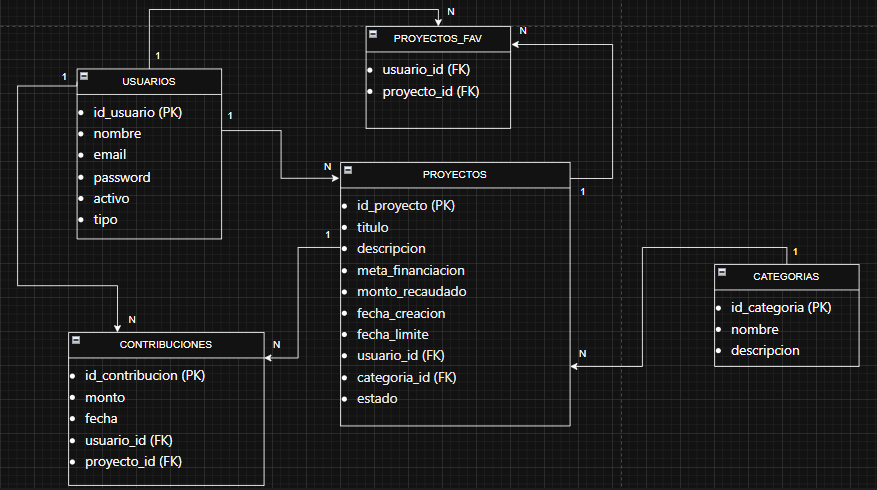
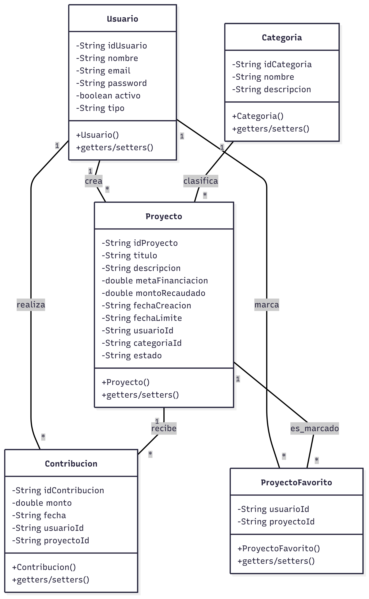

# Diagramas y Clases del Sistema ValidFound

## Diagrama de Base de Datos

## Diagrama de Clases UML  

## Clases Java implementadas
- Usuario.java
- Proyecto.java  
- Categoria.java
- Contribucion.java
- ProyectoFavorito.java
